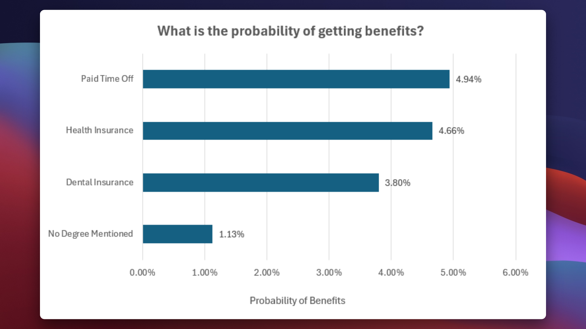

# Dashboard Overview
This documentation focuses specifically on the interactive dashboards. For information about the datasets, please refer to our [Dataset Documentation](/Dataset/README.md).

## Table of Contents
- [Access Control](#access-control)
- [Basic Dashboard](#basic-dashboard)
- [Purpose](#purpose)

  - [Target User](#target-user)
  - [Key Filters](#key-filters)
  - [Note for Data Explorers](#note-for-data-explorers)

- [Required Skills](#required-skills)
- [Key Insights](#key-insights)
- [Power Dashboard](#power-dashboard)
- [Purpose](#purpose-1)

  - [For Job Seekers](#for-job-seekers)
  - [For Market Explorers](#for-market-explorers)
  - [Real-Time Data Advantage](#real-time-data-advantage)

- [Required Skills](#required-skills-1)

<br/>

# Access Control
Both dashboards have protected worksheets and workbooks to maintain data integrity and prevent accidental modifications. If you need to make changes:

**Password**
```
excel
```
<br/>

# Basic Dashboard
Below is a snapshot of the Basic Dashboard interface:

<div align="center">
  
  <p>Basic Dashboard</p>
</div>

<br/>

# Purpose

Designed specifically for job seekers navigating the data industry landscape, this Basic Dashboard serves as your personal compass in the job market. Through an intuitive interface, it empowers users to make informed career decisions based on real market data.

## Target User
The dashboard is primarily tailored for:
- Job seekers in the data industry
- Professionals planning career transitions
- Entry-level candidates exploring opportunities

## Key Filters
The dashboard features carefully crafted data validation filters to customize your job search:
- Position/Role Selection
- Work Schedule Preferences
- Remote Work Options

## Note for Data Explorers
While this dashboard serves job seekers effectively, data enthusiasts and market analysts might find our [Power Dashboard](#power-dashboard) more suitable for in-depth analysis, offering enhanced filtering capabilities through dynamic slicers.

<br/>

# Required Skills
To effectively utilize this dashboard, familiarity with the following Excel concepts is recommended:
- Basic Excel Navigation
- Formula Understanding
- Chart Interpretation
- Data Validation Concepts
- And more.

<br/>

# Key Insights
While this README cannot encompass all possible insights due to the numerous permutations and combinations of filters, we can highlight some significant findings. For instance, let's consider a scenario where you are specifically searching for **full-time Data Analyst positions in the United States** that offer remote work options.

#### What salary can you expect based on different pay structures (hourly, yearly, and standardized yearly from hourly rates)?
<div align="center">
  
  <p>Median salary of $90,000 (Range: $21,000 - $198,000)</p>
</div>
<br/>
<div align="center">
  
  <p>Median salary of $100,000 (Range: $40,000 - $198,000)</p>
  <p>Prefer to get paid yearly.</p>
</div>
<br/>
<div align="center">
  
  <p>Median hourly wage of $26 (Range: $10 - $77)</p>
</div>

<br/>

#### How many jobs match your criteria (e.g., Data Analyst, full-time, remote), and which platform lists the highest number of relevant jobs?
<div align="center">
  
  <p>Over 2,000 job opportunities available, with LinkedIn being the primary source</p>
</div>
<br/>

#### What is the distribution of available jobs across different pay schedules (hourly, monthly, yearly)?
<div align="center">
  
  <p>Majority of positions offer annual compensation</p>
</div>
<br/>

#### What are the probabilities of receiving various benefits (e.g., paid time off, health insurance) based on your selected filters?
<div align="center">
  
  <p>Limited positions available for non-degree holders - education is recommended. Only 5% of positions include paid time off (PTO) benefits - consider negotiating this during offers </p>
</div>
<br/>

#### Which months in 2024 had the highest number of job postings? Additionally, which days of the week saw the most job postings?
<div align="center">
  
  <p>Try applying for jobs in early months, number of postings dips as the year commences</p>
</div>
<br/>

<div align="center">
  
  <p>Avoid applying on weekends</p>
</div>
<br/>

# Power Dashboard

Below is a snapshot of the Basic Dashboard interface:

<div align="center">
  
  <p>Power Dashboard</p>
</div>
<br/>

# Purpose

This enhanced power dashboard transcends traditional analytics, serving as a comprehensive tool for both active job seekers and market researchers.

## For Job Seekers
Transform your job search with our advanced slicer functionality. Now you can:
- Simultaneously explore multiple related roles (e.g., Data Analyst + Business Analyst positions)
- Fine-tune your search parameters in real-time
- Make informed decisions based on current market data
## For Market Explorers
Experience unlimited analytical freedom with:
- Flexible filtering options
- Comprehensive market insights
- Customizable data views
## Real-Time Data Advantage
Thanks to our implemented ETL (Extract, Transform, Load) pipeline:
- One-click data refresh capability
- Always access to the most current market information
- Continuous, up-to-date insights

Whether you're actively seeking opportunities or analyzing market trends, this dashboard ensures you're working with the latest, most relevant data at all times.

<br/>

# Required Skills
To effectively utilize this dashboard, familiarity with the following Excel concepts is recommended:
*   Power Tables
*   Pivot Tables
*   Power Query
*   DAX (Data Analysis Expressions)
*   M-Language
*   Pivot Charts
*   And more.

<br/>

# Key Insights
Assuming the same persona of a **job seeker looking for full-time Data Analyst roles in the United States**, most of the questions are already answered in the basic dashboard. However, to fully leverage the power of this dashboard, I highly recommend that you download and experience it for yourself.
In addition to those already answered, here are some more key insights that this dashboard offers:

#### What are the most in-demand skills?
<div align="center">
  
  <p>While Snowflake tops the chart, the demand is low. Better to focus on Python, R, SQL which aren't far behind.</p>
</div>
<br/>

#### How many skills are typically required for any job role?
<div align="center">
  
  <p>On an average, employers expect 3 skills from Data Analysts.

</p>
</div>
<br/>
